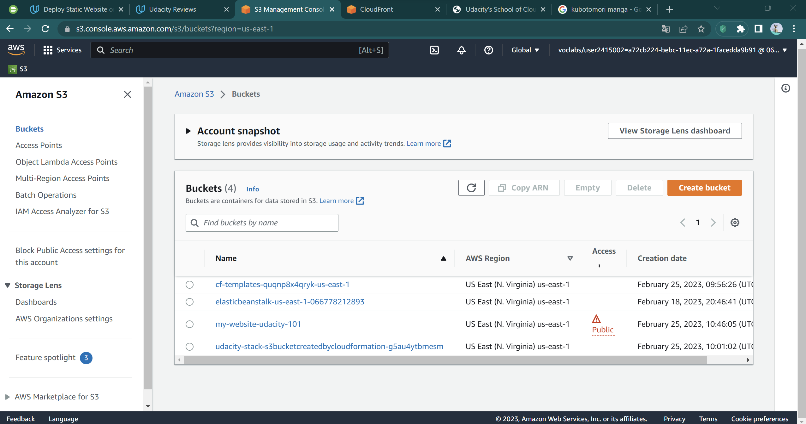
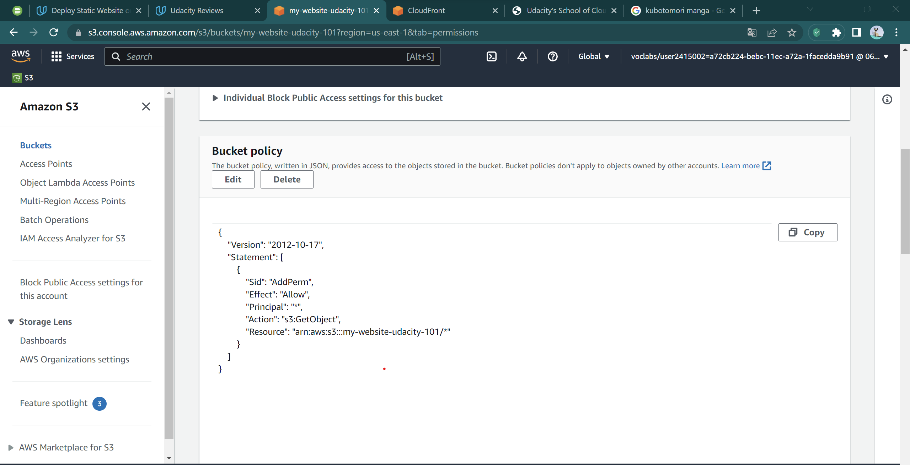
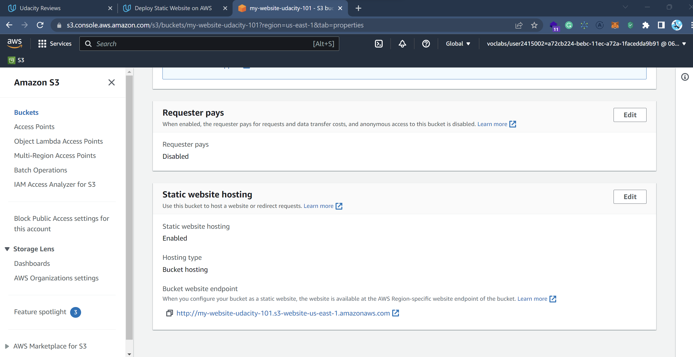
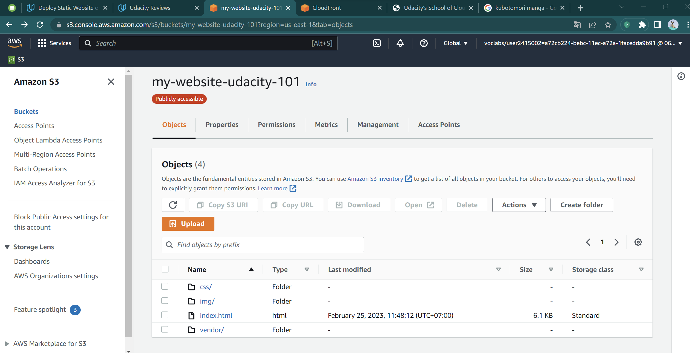
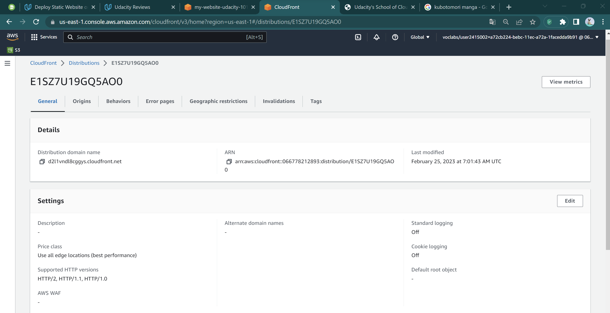
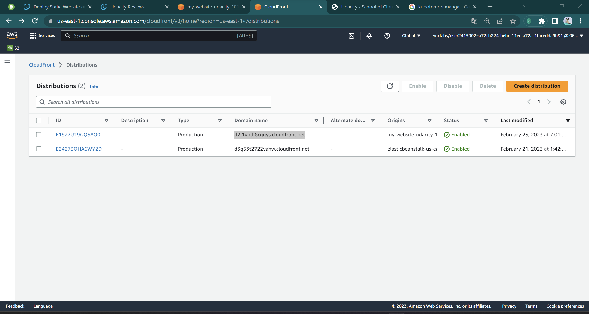

CloudFront endpoint: [https://d2l1vndl8cggys.cloudfront.net/]
S3 endpoint: [http://my-website-udacity-101.s3-website-us-east-1.amazonaws.com]

### 1. Create a bucket on S3 named: my-website-udacity-101

Image 1: 

### 2.1 After that I configured it with correct policy

Image 2.1: 

### 2.2 And also configure static host property

Image 2.2: 

### 3. I uploaded website files into the bucket

Image 3: 

### 4. I created cloudfront distribution

Image 4: 

### 5. My cloudfront endpoint and the final result

Image 5: 
